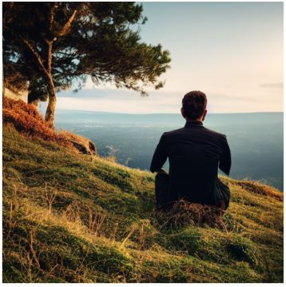
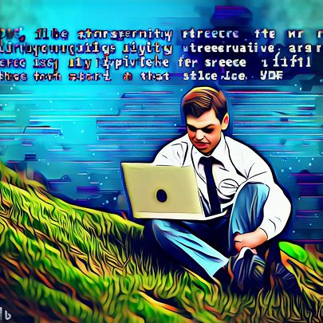

# ai_generated_images

Testing out some prompts. 
- Mabye need to refine my prompts:
	- https://re-thought.com/how-to-create-effective-prompts-for-ai-image-generation/#:~:text=Here%20are%20a%20few%20tips%20to%20keep%20in,colour%20palette%20in%20your%20prompts.%20...%20More%20items
- The result of these prompts and reading the book below have made me wonder about gender bias in these image generation models. My exercise to prove the gender bias is located here: 
	- https://github.com/MeredithHilgeman/ai_generated_images/tree/main/gender_bias
	- https://carolinecriadoperez.com/book/invisible-women/

## Stable Diffusion

Prompt: a data scientist sitting on a hillside, digital style

## Microsoft Bing's Distribution of DALL-E

Prompt: a data scientist sitting on a hillside, digital style

