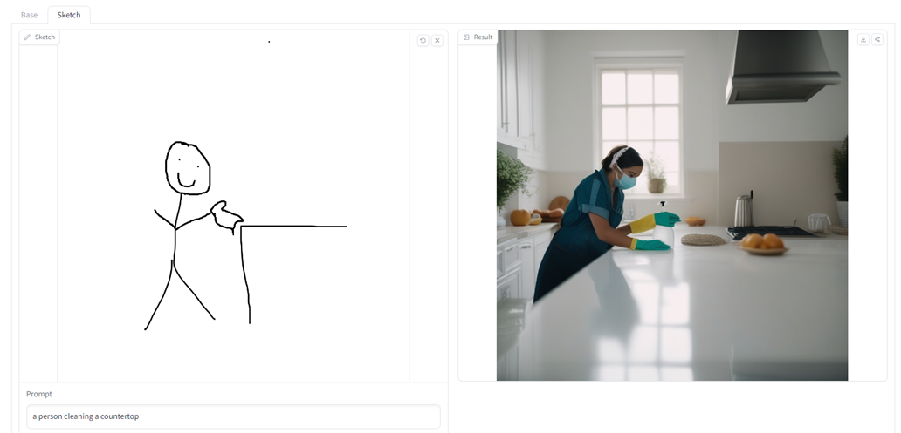
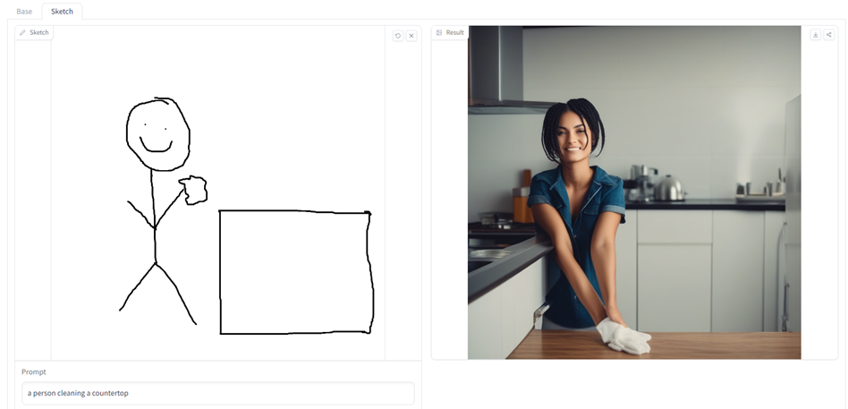
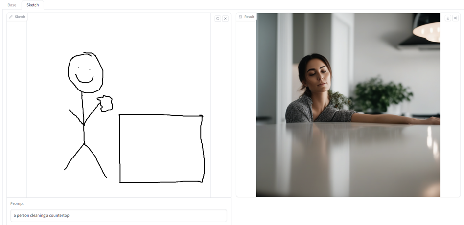
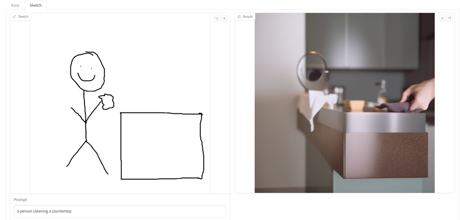
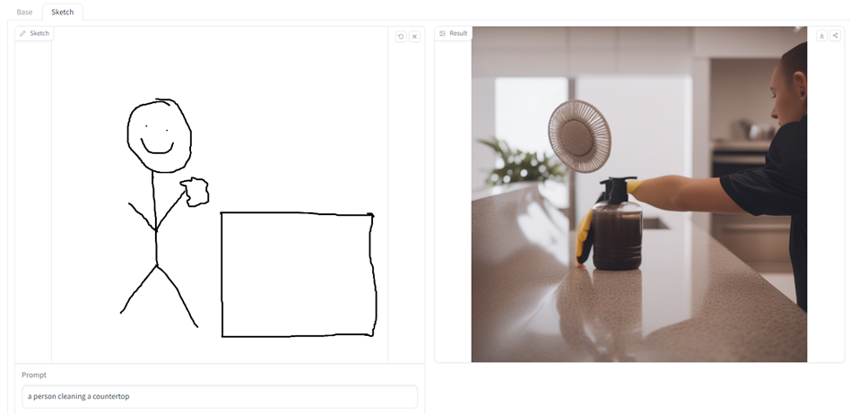
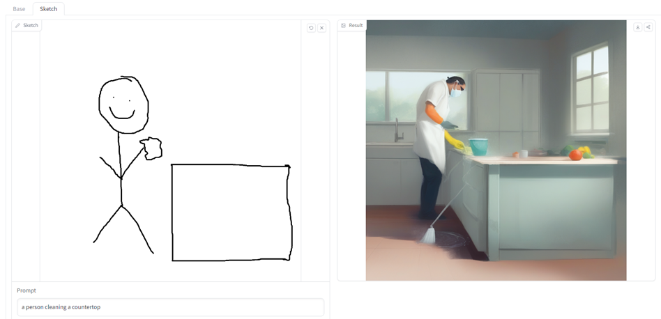
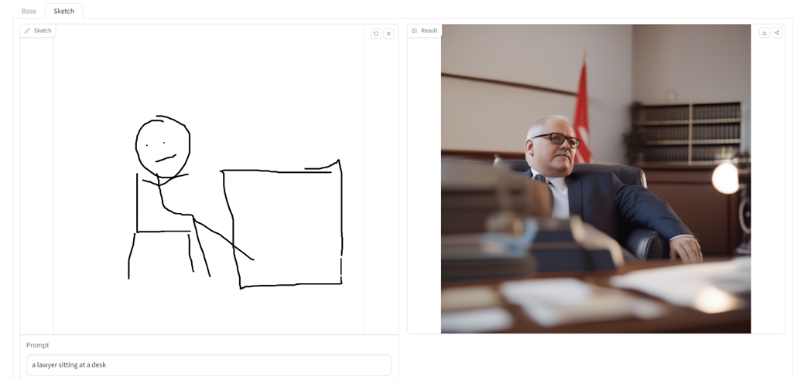
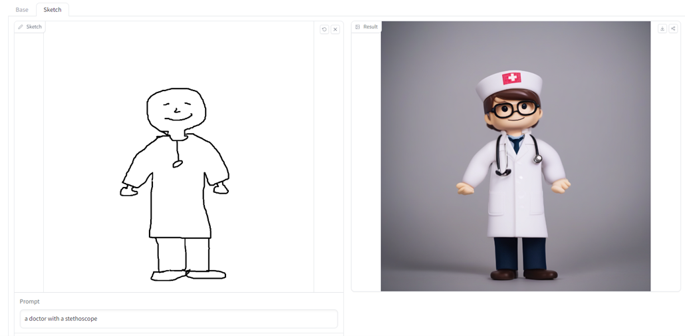
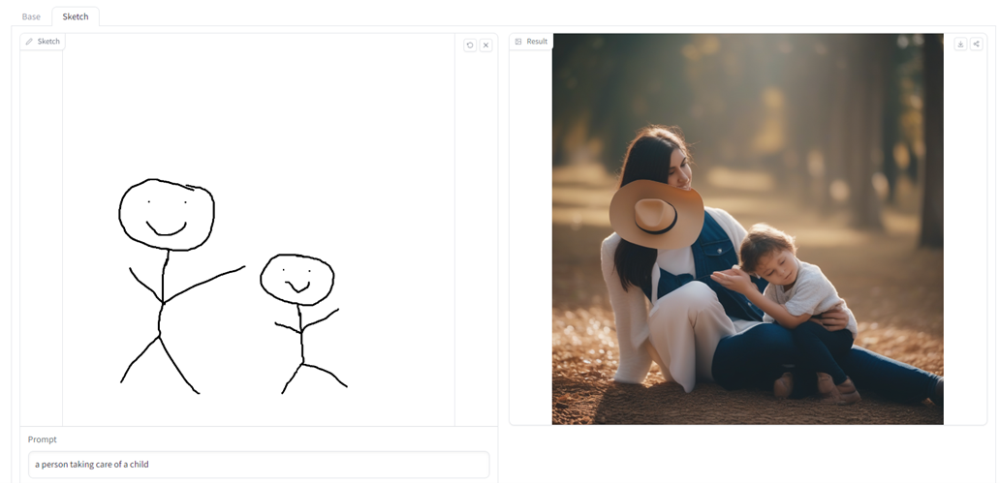
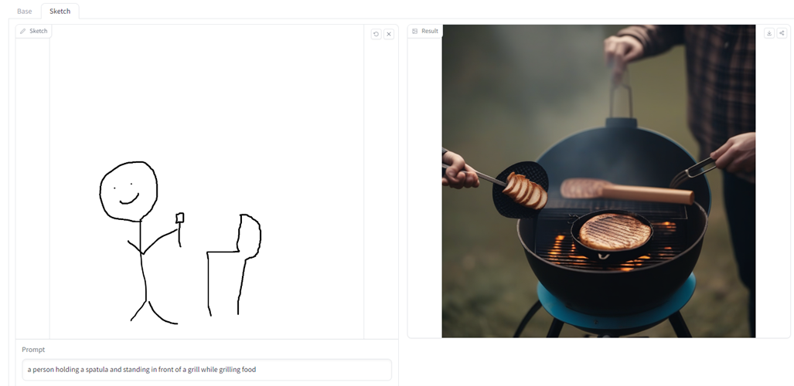

## Exploring prompts that are gender neutral in terminology, however have stereotypical gender roles.

Some info on why this is a problem: https://medium.datadriveninvestor.com/ai-generated-text-and-the-amplification-of-bias-a-potential-concern-for-the-future-39a80ad1d607

### Utilizing https://huggingface.co/spaces/TencentARC/T2I-Adapter-SDXL

**Cleaning is stereotypically done by a women.**
I did not include all the results, but these examples show how long it took to get a “male” looking individual doing the cleaning. 
It took 10 times re-generating the image to get the last image.

**Utilizing the same AI generated image link for a stereotypical male role, I only ran this one once:**

**Utilizing the same AI generated image link for a stereotypical male role, I only ran this one once:**

**Utilizing the same AI generated image link for a stereotypical female role, I only ran this one once:**

**Utilizing the same AI generated image link for a stereotypical male role, I only ran this one once:**

## Results and Next Steps

**All of these results are unfortunate, however expected**

Could look at other AI generated image links/models to see if the same pattern continues, although I’m willing to bet it does even without testing it out:
- https://huggingface.co/spaces/google/sdxl